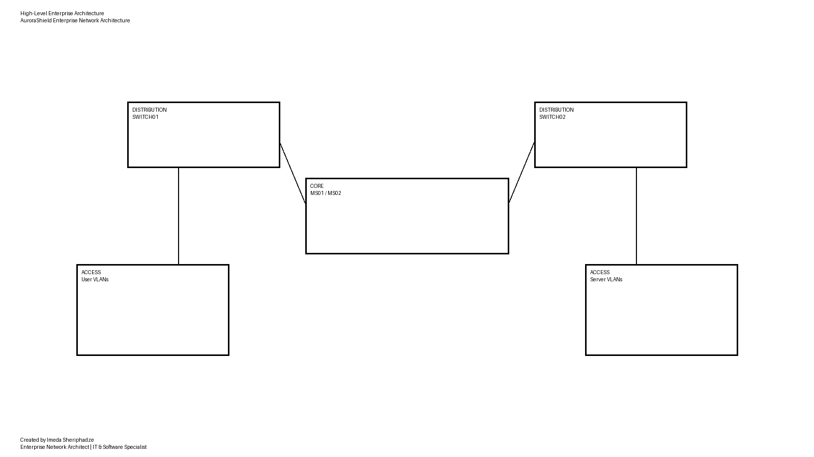
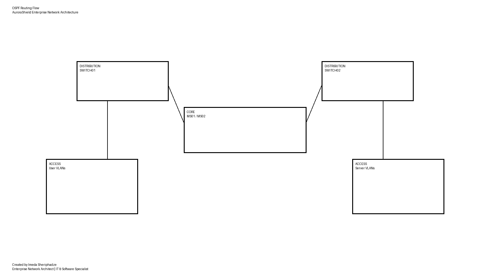

# AuroraShield Enterprise Network Architecture

Enterprise-grade Cisco network architecture demonstrating secure segmentation, deterministic routing, and infrastructure observability aligned with modern enterprise deployment practices.

---

## Author

**Imeda Sheriphadze**
Enterprise Network Architect
IT & Software Specialist

---

## Project Overview

AuroraShield Enterprise Network Architecture is a comprehensive multi-layer Cisco-based network design built to reflect real-world enterprise infrastructure deployment models.

This project demonstrates applied networking engineering expertise through implementation of hierarchical topology design, secure segmentation, routing governance, and management plane isolation. The architecture leverages native Cisco capabilities to maintain deterministic control, reduce external dependency, and minimize attack surface exposure.

This repository serves as a professional portfolio demonstration and technical reference implementation.

---
## Topology Summary
Dual-distribution hierarchical enterprise topology featuring:

- Redundant Layer-3 Core
- Segmented VLAN security domains
- OSPF dynamic routing
- Management plane isolation
- Hardened device access controls

## Architecture Goals

* High availability and resilience
* Segmentation-driven security enforcement
* Deterministic routing behavior
* Infrastructure observability and monitoring
* Secure administrative access governance
* Vendor-native control without external dependency

---

## Key Architecture Highlights

* Hierarchical Core / Distribution / Access topology
* OSPF backbone routing with authentication
* VLAN segmentation and gateway isolation
* Layer-2 attack mitigation mechanisms
* Control Plane Protection (CoPP)
* SNMPv3 monitoring
* NetFlow telemetry visibility
* AAA-secured administrative access
* Management plane isolation

---

## Architecture Diagrams

### High Level Architecture

---

### Security Zoning

---

### VLAN Segmentation

---

### OSPF Routing Flow

---

### Management Isolation

---

## Repository Structure

| Folder           | Description                       |
| ---------------- | --------------------------------- |
| `configs/`       | Device configuration files        |
| `diagrams/`      | Architecture visual documentation |
| `documentation/` | Technical design documentation    |
| `presentation/`  | Project presentation materials    |
| `motivation/`    | Professional submission material  |
| `archive/`       | Historical and backup resources   |

---

## Implementation Environment

* Cisco IOS / IOSvL2 simulation
* EVE-NG virtualization platform
* Enterprise VLAN segmentation model
* Multi-layer routing topology
* Secure remote management architecture

---

## How This Project Was Built

The architecture was designed using enterprise methodology emphasizing scalability, security, and observability. Configuration and validation were performed through iterative simulation cycles to ensure deterministic behavior across routing domains and segmentation boundaries.

Validation included:

* Routing convergence verification
* Access control enforcement checks
* Segmentation boundary testing
* Administrative isolation validation
* Traffic visibility inspection

---

## Professional Objective

This project demonstrates applied enterprise networking capability and architectural design discipline. It showcases readiness for collaboration within professional networking environments and contribution to large-scale infrastructure initiatives.

---

## Contact

**Imeda Sheriphadze**
Email: [isheriphadze@gmail.com](mailto:isheriphadze@gmail.com)
GitHub: [https://github.com/imeda1968](https://github.com/imeda1968)

---
